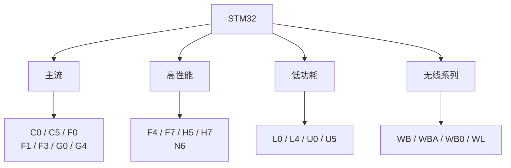

# STM32系列介绍

在整个意法半导体家族中，STM32并不单指某一颗芯片，他是一整个微控制器系列。在他们的产品型号中，常常会看到类似于：“STM32F103C8T6”，“STM32F407VET6"之类的。所以，我们先来认识一下这些型号组成。


不同 STM32 系列使用不同的 Cortex-M 内核，并针对性能、功耗、模拟控制、通信、安全等不同方向进行了设计。

---

## STM32 为什么要分这么多系列

不同项目对 MCU 的要求并不一样。

一个简单的温度采集设备可能只需要：

```text
GPIO
ADC
USART
低功耗
```

而一台电机控制器可能需要：

```text
高速 CPU
高级定时器
PWM
ADC
比较器
运算放大器
```

机器人控制器又可能需要：

```text
高速 CPU
大量 RAM
DMA
CAN
USB
高速通信接口
```

如果所有 MCU 都采用同一套硬件设计，就很难同时兼顾成本、性能和功耗。

因此 ST 将 STM32 划分成了很多产品系列，让不同系列针对不同应用场景进行优化。ST 官方目前将 STM32 产品划分为 Mainstream、Ultra-low-power、High-performance、Wireless 等方向。

可以先形成这样一个概念：



这里不需要把每个型号全部记下来。

学习 STM32 时，首先需要知道的是：

> 不同系列对应的是不同的硬件定位。

---

## STM32F 系列

F 系列是 STM32 中非常经典的一类产品。

其中又包含多个系列：

```text
STM32F0
STM32F1
STM32F2
STM32F3
STM32F4
STM32F7
```

不同系列使用的 Cortex-M 内核和硬件资源有所不同。

例如：

```text
F0 → Cortex-M0
F1 → Cortex-M3
F2 → Cortex-M3
F3 → Cortex-M4
F4 → Cortex-M4
F7 → Cortex-M7
```

随着系列编号提高，通常也伴随着更高的性能和更丰富的外设，但具体能力仍然需要查看对应型号的数据手册。

### STM32F1

STM32F1 是 STM32 中非常经典的系列。

其中的 STM32F103 使用 Cortex-M3 内核，最高主频 72 MHz。

以 STM32F103C8 为例：

```text
CPU       Cortex-M3
最高主频   72 MHz
Flash     64 KB
SRAM      20 KB
```

同时拥有 GPIO、定时器、ADC、USART、SPI、I2C、USB、CAN 等外设。

本教程使用的 STM32F103C8T6 就属于这一系列。

---

## STM32F4

STM32F4 是使用 Cortex-M4 内核的经典高性能系列。

相比 F1，F4 通常具有更高的主频、更大的存储空间以及更丰富的外设。

例如一些 F4 型号具有：

```text
Cortex-M4
FPU
DSP 指令
高速定时器
DMA
USB
CAN
SDIO
FSMC / FMC
```

因此 F4 经常用于：

```text
电机控制
工业设备
数据采集
图形界面
机器人
通信设备
```

不过具体型号之间差异很大，不能只根据“F4”三个字符判断完整的硬件配置。

---

## STM32F7

STM32F7 使用 Cortex-M7 内核。

这一系列进一步提升了处理能力，适合需要较高计算性能的场景。

例如：

```text
高速数据处理
图形界面
音频处理
通信设备
复杂控制
```

F7 仍然属于 MCU，但已经可以承担相当复杂的任务。

---

## STM32H 系列

H 系列主要面向高性能应用。

其中最熟悉的一类就是：

```text
STM32H7
```

STM32H7 可以使用 Cortex-M7，也有部分产品采用 Cortex-M4 与 Cortex-M7 的组合。

部分 H7 产品的主频可以达到数百 MHz，并提供更大的 RAM、更强的 DMA 和更丰富的高速接口。ST 当前产品组合中的部分 H7 型号已经达到 600 MHz。

因此 H7 经常出现在：

```text
高性能机器人控制器
工业控制设备
高速数据采集
图形显示
音视频处理
复杂嵌入式系统
```

例如：

```text
STM32H743
```

就是 H7 系列中的一款高性能 MCU。

---

## STM32G 系列

G 系列是比较新的主流 STM32 产品线。

其中常见的有：

```text
STM32G0
STM32G4
```

### STM32G0

G0 主要面向成本敏感的主流应用。

它采用 Cortex-M0+ 内核。

相比早期的 F0，G0 在很多型号上提供了更现代的外设和更丰富的功能。

---

### STM32G4

G4 则更加偏向：

```text
电机控制
数字电源
模拟信号处理
高性能实时控制
```

G4 使用 Cortex-M4 内核，并针对混合信号应用进行了大量优化。

例如部分型号集成：

```text
高速 ADC
DAC
比较器
运算放大器
高级定时器
```

因此 G4 很适合用于电机、电源以及各种需要模拟与数字协同处理的设备。

---

## STM32L 和 STM32U 系列

L 系列与 U 系列主要面向低功耗应用。

例如：

```text
STM32L0
STM32L4
STM32L5
STM32U0
STM32U3
STM32U5
```

这类 MCU 通常关注：

```text
低功耗
低电压
电池供电
长时间运行
```

常见应用包括：

```text
传感器
可穿戴设备
便携设备
智能仪表
电池设备
```

STM32U5 等新型号已经提供了更高的性能，同时继续强调低功耗特性。ST 当前资料中，U5 系列最高可达到 160 MHz，并提供较大的 Flash 和 RAM。

---

## STM32C 系列

C 系列可以理解为 STM32 家族中更加关注成本和主流控制应用的一类产品。

目前常见的有：

```text
STM32C0
STM32C5
```

其中 C0 使用 Cortex-M0+，最高主频 48 MHz，适合：

```text
简单控制
传感器
小型家电
低成本控制板
```

而 C5 则面向更高性能的主流应用，使用 Cortex-M33，最高主频可以达到 144 MHz。

---

## STM32 无线系列

STM32 也有专门面向无线通信的产品。

例如：

```text
STM32WB
STM32WBA
STM32WB0
STM32WL
```

这些产品在 MCU 的基础上加入了无线通信能力。

例如：

```text
Bluetooth LE
Zigbee
Thread
Matter
Sub-GHz
```

具体协议取决于产品系列。

这类 MCU 可以用于：

```text
智能家居
物联网设备
无线传感器
低功耗终端
工业无线设备
```

ST 当前无线产品组合包括 WB、WBA、WB0 和 WL 等系列。

---

## STM32 系列应该怎么理解

初学阶段可以先记住下面这张表：

| 系列            | 大致定位              |
| ------------- | ----------------- |
| C0            | 低成本、基础控制          |
| C5            | 新一代主流、高性能         |
| F0            | 入门级               |
| F1            | 经典主流              |
| F2            | 较高性能              |
| F3            | 模拟与控制             |
| F4            | 高性能通用 MCU         |
| F7            | 更高性能              |
| G0            | 新一代主流             |
| G4            | 电机、电源、模拟控制        |
| H5            | 高性能与安全            |
| H7            | 高性能               |
| L0/L4/L5      | 低功耗               |
| U0/U3/U5      | 新一代低功耗            |
| WB/WBA/WB0/WL | 无线通信              |
| N6            | 带神经网络加速能力的高性能 MCU |

这张表只用于建立整体认识。

真正选择 MCU 时，仍然需要查看具体型号的数据手册和参考手册。

因为同一个系列内部，不同型号之间的：

```text
Flash
SRAM
GPIO 数量
定时器
ADC
通信接口
封装
```

都可能不同。

---

## 为什么本教程选择 STM32F103C8T6

本教程使用：

```text
STM32F103C8T6
```

它属于：

```text
STM32
  └── F1
       └── F103
            └── C8
                 └── T6
```

STM32F103C8 属于 STM32F103 中密度性能系列。

其主要资源包括：

```text
Cortex-M3
72 MHz
64 KB Flash
20 KB SRAM
```

并提供 GPIO、ADC、定时器、USART、SPI、I2C、USB、CAN 等常用外设。

对于学习 MCU 来说，这些资源已经足够覆盖大量基础知识：

```text
GPIO
RCC
中断
定时器
PWM
USART
SPI
I2C
ADC
DMA
Flash
```

因此后面的学习不会局限于某一个 LED 或某一个例程。

而是可以通过 F103C8T6，把 MCU 的基本工作方式、STM32 的外设结构以及 HAL 开发流程完整走一遍。

---

## 一个很重要的认识

学习 STM32 时，不需要把所有型号都记住。

更重要的是看到一个型号时，能够知道：

```text
它属于哪个系列
        ↓
大概是什么定位
        ↓
使用什么 Cortex-M 内核
        ↓
有哪些主要资源
        ↓
具体型号的数据手册在哪里
```

例如看到：

```text
STM32H743
```

能够知道它属于 H7 高性能系列。

看到：

```text
STM32G474
```

能够知道它属于 G4 系列，主要面向高性能实时控制以及混合信号应用。

看到：

```text
STM32F103C8T6
```

则知道它属于经典的 F1 系列。

这样，面对一个陌生 STM32 型号时，就已经有了基本的判断依据。
